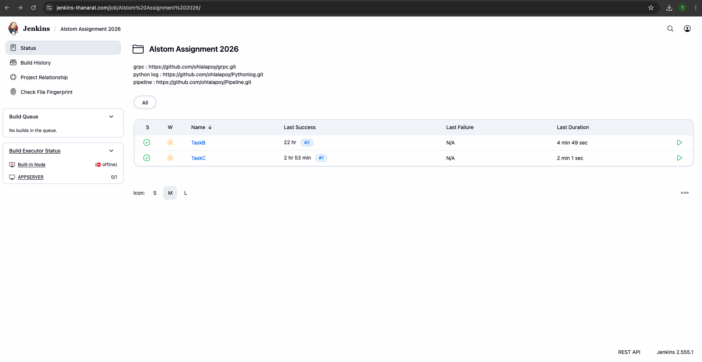
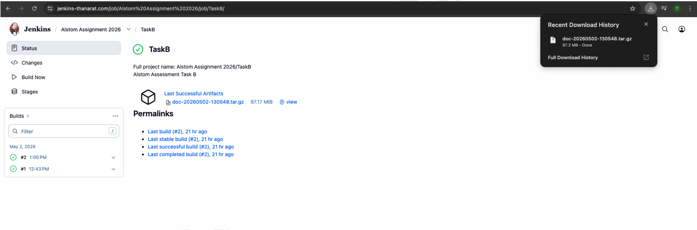
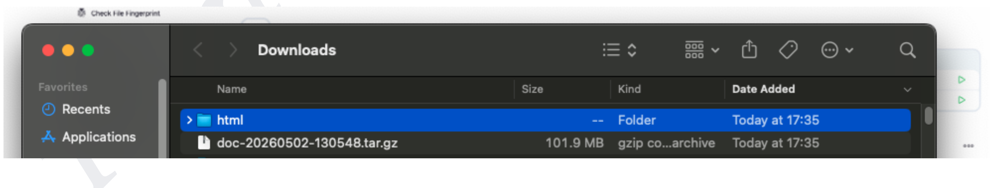
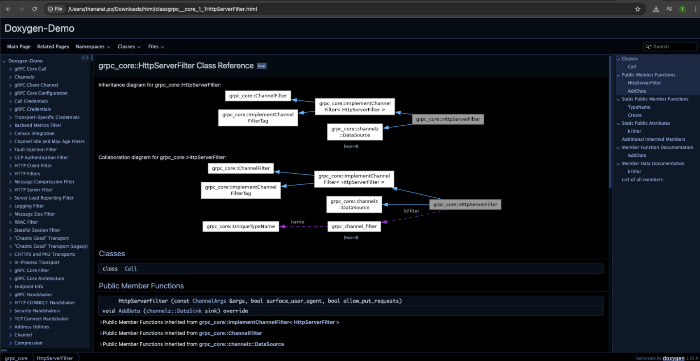
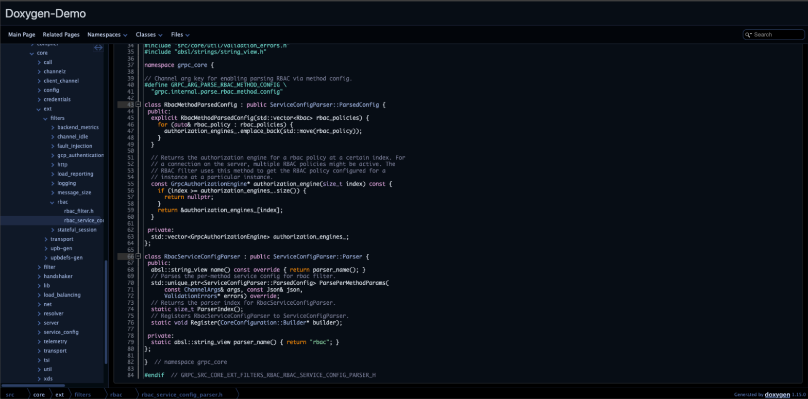
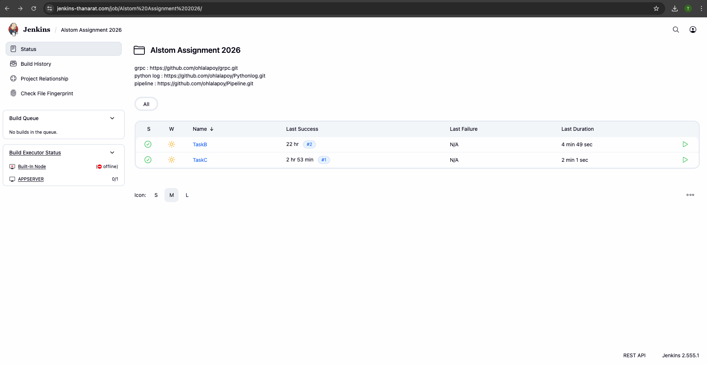
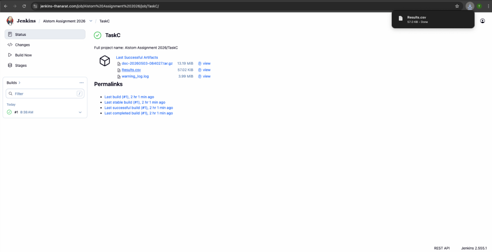
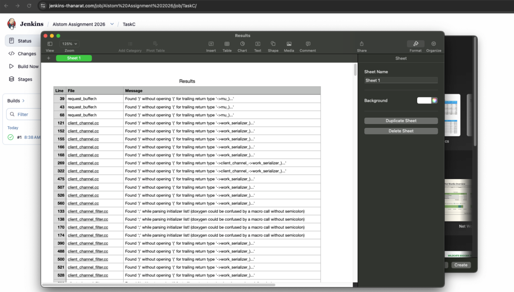
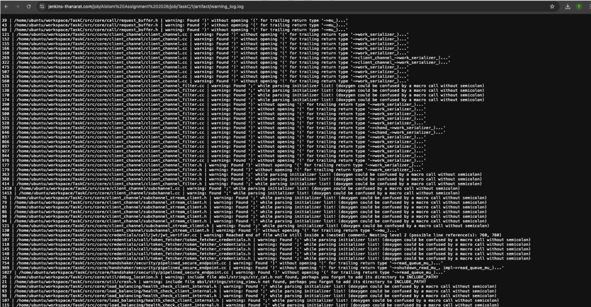

# Alstom Assessment 2026 #

**Author:** Thanarat Ponpanasak

- **Jenkins:** https://www.jenkins-thanarat.com
- **GitHub:** https://github.com/ohlalapoy

---

## 1. How did you test your pipelines?

### Task B

**Steps:**

1. Navigate through **Alstom Assignment 2026** → Click **TaskB**

2. After the job has been completed successfully, `doc.tar.gz` will appear and be ready to download.

3. Extract the file, then open the `.html` file from the output folder.

The Doxygen-generated HTML documentation was successfully produced, including:

---

## 2. How did you test repoC python?

### Task C

**Steps:**

1. Navigate through **Alstom Assignment 2026** → Click **TaskC**

2. After the job has been completed successfully, the following artifacts will be available to download:

> **Note:** These logs are automatically generated from TaskB, so you don't have to upload them yourself.

---

### Parse and Reverse to .csv

The Python script in TaskC parses the raw compiler warning log and converts it into a structured `.csv` file.

**Example warning types found in the raw log:**

---
## 3. What is the advantage to use LFS?

